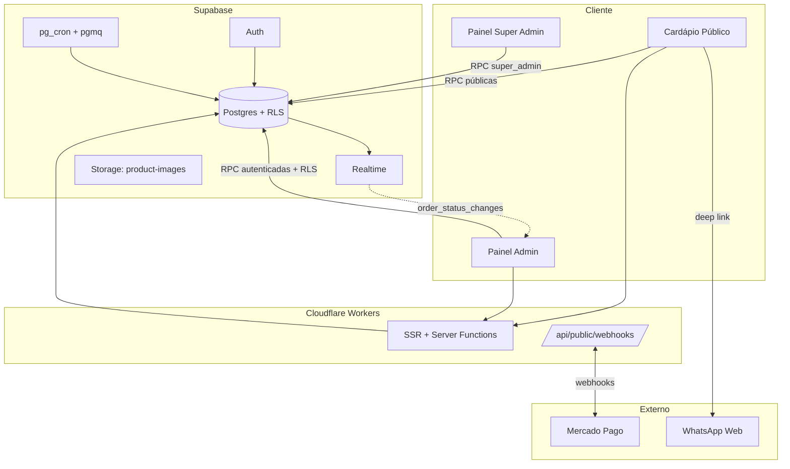
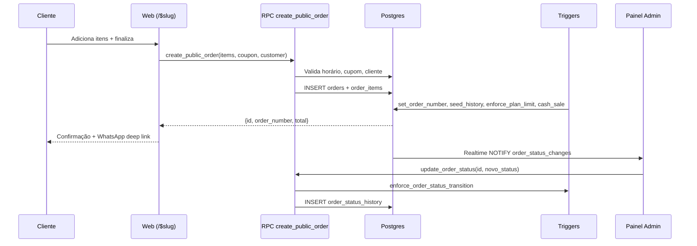
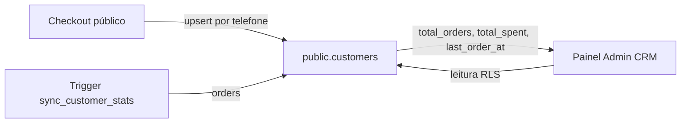
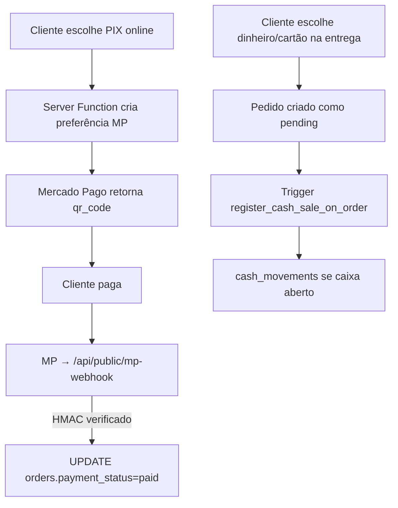
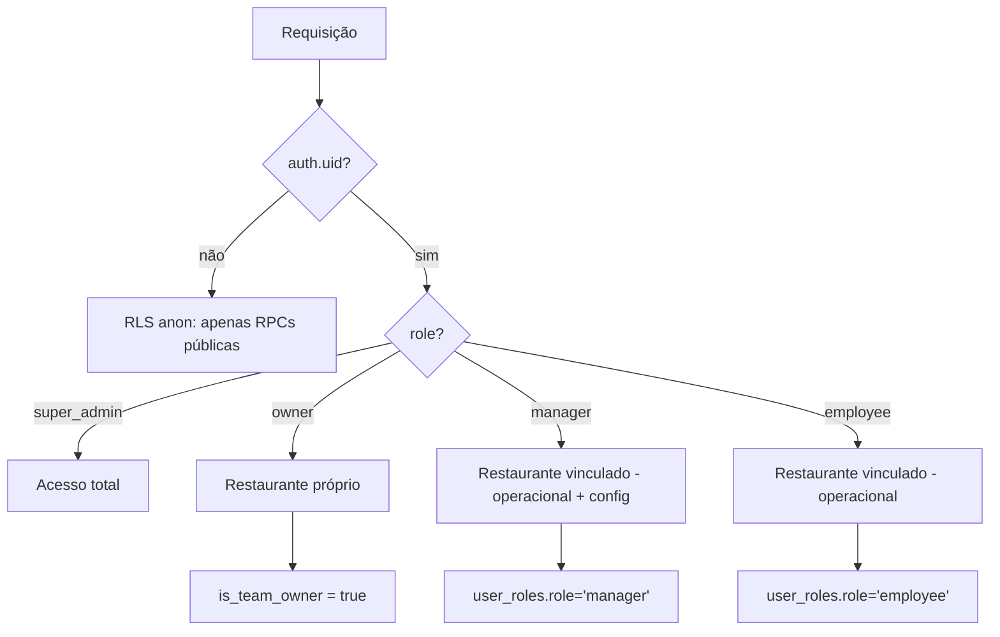

# Arquitetura Geral — Comandex

## Stack

| Camada | Tecnologia |
|---|---|
| Frontend | React 19 + TanStack Start v1 + Vite 7 |
| Roteamento | TanStack Router (file-based, `src/routes/`) |
| Estado servidor | TanStack Query |
| Estilo | Tailwind v4 + tokens semânticos em `src/styles.css` |
| Backend | Supabase (Postgres 15 + PostgREST + Realtime) |
| Auth | Supabase Auth (email/password, Google OAuth) |
| Pagamentos | Mercado Pago (PIX online, checkout transparente) |
| Runtime servidor | Cloudflare Workers (workerd, nodejs_compat) |
| Deploy | Lovable Cloud |

## Visão Macro



## Frontend

- **Rotas públicas**: `/`, `/planos`, `/glossario`, `/$slug` (cardápio), `/auth`, landing pages segmentadas.
- **Rotas autenticadas**: `/admin/*` (owner/manager/employee), `/super-admin/*` (super_admin).
- **Guardas**: `useAuth` + verificação de `user_roles` server-side via RPC `is_team_owner`.
- **Padrão de leitura**: `queryClient.ensureQueryData()` no loader + `useSuspenseQuery` no componente.
- **Padrão de escrita**: sempre via RPC (`supabase.rpc(...)`) — nunca `INSERT/UPDATE` direto em tabela crítica.

## Backend

### Filosofia
- **Toda regra crítica em SQL** (`SECURITY DEFINER` com `search_path` fixo).
- **RLS bloqueia por padrão**; RPC público substitui `SELECT` anônimo quando necessário.
- **Tabelas nunca aceitam escritas cruas** para pedidos, cupons, convites, papéis.

### Componentes
| Componente | Responsabilidade |
|---|---|
| Tabelas `public.*` | Persistência com RLS |
| Schema `private` | Helpers internos (não acessíveis via API) |
| RPCs | API pública tipada com validação |
| Triggers | Consistência (updated_at, order_number, customer stats, state machine) |
| pgmq | Filas assíncronas (emails transacionais) |
| pg_cron | Dispatcher periódico da fila de emails |
| Edge functions | ❌ Não utilizadas (substituídas por `createServerFn` + `/api/public/*`) |

## Fluxo — Pedidos



## Fluxo — Clientes



Identificador único: `(restaurant_id, phone)` — telefone normalizado (só dígitos).

## Fluxo — Pagamentos



## Fluxo — Autenticação

```mermaid
graph LR
  A[/auth] -->|email+senha ou Google| B[Supabase Auth]
  B --> C[handle_new_user trigger]
  C --> D[public.profiles]
  B --> E[useAuth hook]
  E -->|carrega restaurant + role| F[Redirect por papel]
  F -->|owner/manager/employee| G[/admin]
  F -->|super_admin| H[/super-admin]
  F -->|sem restaurante| I[/onboarding]
```

## Fluxo — Permissões



## Estrutura de Diretórios

```
src/
├── routes/              # File-based routing (TanStack)
│   ├── __root.tsx       # Head, providers, favicon
│   ├── index.tsx        # Landing
│   ├── $slug.tsx        # Cardápio público
│   ├── admin/           # Painel restaurante
│   ├── super-admin/     # Painel plataforma
│   └── api/public/      # Webhooks
├── components/          # UI shadcn + componentes de domínio
├── hooks/               # useAuth, usePlanFeatures, ...
├── integrations/supabase/  # Cliente autogerado (NÃO EDITAR)
├── lib/                 # Server functions (*.functions.ts)
└── styles.css           # Tokens semânticos + tema
supabase/migrations/     # SQL versionado
docs/                    # Esta documentação
```
