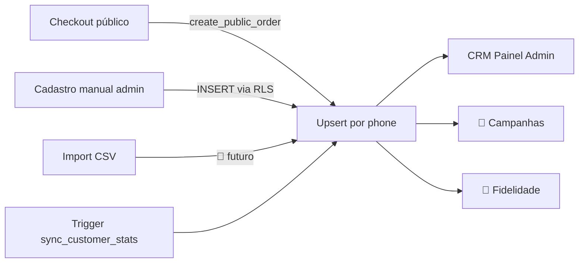

# Estrutura de Clientes — Comandex

## Modelo

Tabela: `public.customers`
Identificador único: `(restaurant_id, phone)` — telefone normalizado com `regexp_replace('\D','','g')`.
**Não** existe cliente global — cada restaurante possui seu próprio CRM (isolamento multi-tenant).

## Colunas Principais

| Coluna | Tipo | Descrição |
|---|---|---|
| `id` | uuid | PK |
| `restaurant_id` | uuid | FK — tenant |
| `name` | text | Nome (1–120 chars) |
| `phone` | text | Só dígitos (6–20) — chave de dedupe |
| `email` | text | Opcional |
| `birthday` | date | Para campanhas |
| `notes` | text | Anotações internas |
| `tags` | text[] | Segmentação livre (`vip`, `fiel`, `inadimplente`, ...) |
| `source` | text | `checkout`, `manual`, `import`, `campaign` |
| `is_blocked` | boolean | Bloqueia novos pedidos |
| `opt_in_marketing` | boolean | LGPD — consentimento explícito |
| `opt_in_whatsapp` | boolean | Idem para WhatsApp |
| `total_orders` | int | Denormalizado por trigger |
| `total_spent` | numeric | Denormalizado por trigger |
| `first_order_at` | timestamptz | Denormalizado |
| `last_order_at` | timestamptz | Denormalizado |
| `cashback_balance` | numeric | 🚧 Programa de fidelidade |
| `loyalty_points` | int | 🚧 |

## Upsert

Exclusivamente via `create_public_order` (backend). O checkout **não** cria `customer` separadamente — é feito dentro da mesma transação do pedido para garantir consistência.

RPC auxiliar `upsert_public_customer` existe para casos administrativos.

## Sincronização de Estatísticas

Trigger `sync_customer_stats` em `orders` (AFTER INSERT/UPDATE/DELETE):
- Recalcula `total_orders`, `total_spent`, `first_order_at`, `last_order_at`.
- Ignora `status='cancelled'`.
- Roda para o customer antigo e novo em caso de reatribuição.

## Segmentação (🚧 Sprint 4+)

Segmentos previstos:
- **Novos** (1 pedido, < 7 dias)
- **Fiéis** (≥ 5 pedidos, últimos 30 dias)
- **Inativos** (sem pedido > 60 dias)
- **VIP** (ticket médio > R$100 OU total_spent > R$1000)
- **Aniversariantes do mês**

Implementação: view materializada `customer_segments` refresh diário.

## Programa de Fidelidade (🚧)

- Cashback percentual por pedido concluído.
- Pontos → conversão em desconto.
- Config por restaurante em `restaurants.loyalty_config` JSONB.

## Campanhas (🚧)

Tabela planejada: `customer_campaigns`
- Filtros por segmento + tags
- Canal: WhatsApp (Business API) / Email
- Métricas de conversão

## LGPD

- Consentimento explícito para marketing (`opt_in_marketing`, `opt_in_whatsapp`).
- Cliente pode solicitar exclusão → RPC `delete_customer_data` (🚧).
- Log de acesso a dados sensíveis (🚧 Sprint 5).

## Fluxos

## Regras

- ❌ Não criar `customer` sem `phone`.
- ❌ Não armazenar telefone formatado (sempre só dígitos).
- ❌ Não expor CRM entre tenants (RLS bloqueia).
- ✅ Sempre passar por `create_public_order` no fluxo público.
- ✅ Estatísticas são denormalizadas — nunca calcular no frontend.
