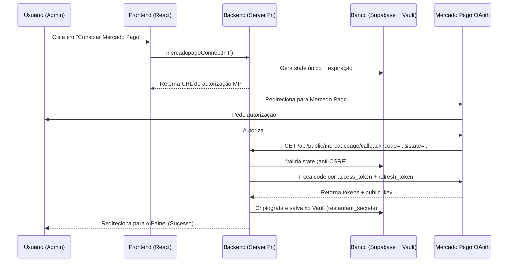
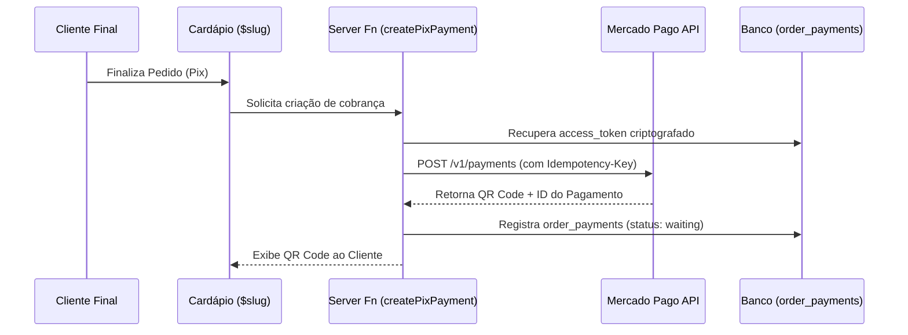
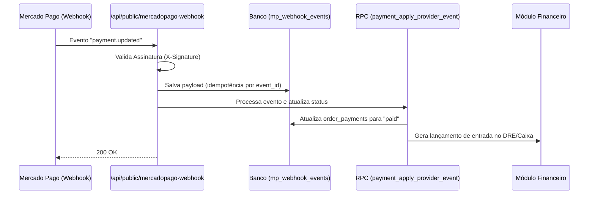

# Arquitetura Mercado Pago Connect — Mesivo V4

## 1. Fluxo de Autorização (OAuth 2.0)

## 2. Fluxo de Pagamento Pix

## 3. Fluxo de Webhook e Conciliação

## 4. Estratégia de Refresh Token

- **Gatilho:** Falha 401 na API ou verificação periódica (TTL).
- **Processo:** O Backend utiliza o `refresh_token` salvo para obter um novo par de tokens.
- **Rotação:** O novo `refresh_token` substitui o antigo imediatamente para manter a validade da conexão sem intervenção do lojista.
