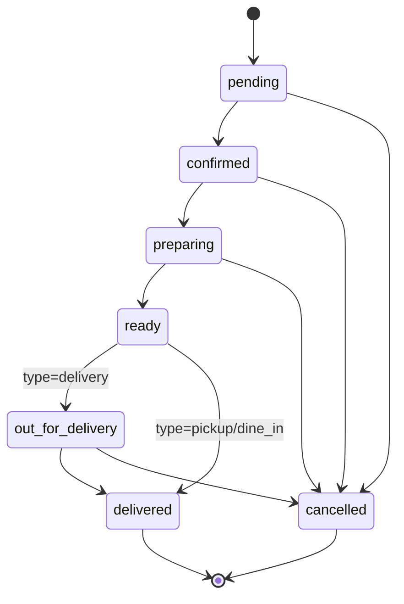

# Máquina de Estados — Pedidos

Fonte única de transições: `private.is_valid_order_transition(from, to, type)`.
Enforço: trigger `enforce_order_status_transition` (BEFORE UPDATE em `orders`) + RPC `update_order_status`.

## Estados

| Estado | Descrição |
|---|---|
| `pending` | Recém-criado, aguarda confirmação do restaurante |
| `confirmed` | Restaurante aceitou; cliente notificado |
| `preparing` | Em preparo na cozinha |
| `ready` | Pronto (para retirada / aguardando entregador) |
| `out_for_delivery` | Saiu para entrega (apenas `delivery`) |
| `delivered` | Entregue/finalizado |
| `cancelled` | Cancelado (terminal) |

## Diagrama



## Regras

- `delivered` e `cancelled` são **terminais** (sem transições de saída).
- `out_for_delivery` só é válido para `type = 'delivery'`.
- Toda transição inválida lança `check_violation: invalid_transition: X → Y`.
- **UPDATE direto** em `status` é bloqueado (`status_change_forbidden`) — usar sempre `update_order_status()`.

## Eventos e Timeline

Cada transição:
1. Grava linha em `order_status_history` (`from_status`, `to_status`, `changed_by`, `source`, `reason`).
2. Trigger `trg_order_status_history_notify` emite `pg_notify('order_status_changes', payload)`.
3. Painel admin consome via Supabase Realtime → refetch da lista.
4. UI do pedido lê timeline via RPC `get_order_history`.

### Payload do evento
```json
{
  "order_id": "uuid",
  "restaurant_id": "uuid",
  "old_status": "confirmed",
  "new_status": "preparing",
  "source": "panel",
  "changed_by": "uuid",
  "reason": null,
  "created_at": "2026-07-01T14:22:00Z"
}
```

## Responsáveis

| Transição | Quem executa (típico) |
|---|---|
| `pending → confirmed` | Owner/manager/employee (painel) |
| `pending → cancelled` | Owner/manager (com motivo) |
| `confirmed → preparing` | Employee/KDS (🚧) |
| `preparing → ready` | Employee/KDS (🚧) |
| `ready → out_for_delivery` | Employee / App do Entregador (🚧) |
| `out_for_delivery → delivered` | Entregador / cliente (confirmação — 🚧) |

## Fontes (`source`)

- `web` — criado pelo cardápio público
- `panel` — alteração no admin
- `kds` — Kitchen Display System (🚧 Sprint 3)
- `driver_app` — App do entregador (🚧)
- `system` — automação (ex.: cancelamento por timeout — 🚧)
- `webhook_mp` — confirmação de pagamento MP

## Integrações Futuras

- 🚧 Auto-confirmação após N minutos sem ação (config por restaurante).
- 🚧 Auto-cancelamento se PIX não pago em 15min.
- 🚧 Push notification ao cliente em cada transição.
- 🚧 SLA tracking (tempo entre estados) para dashboard.
