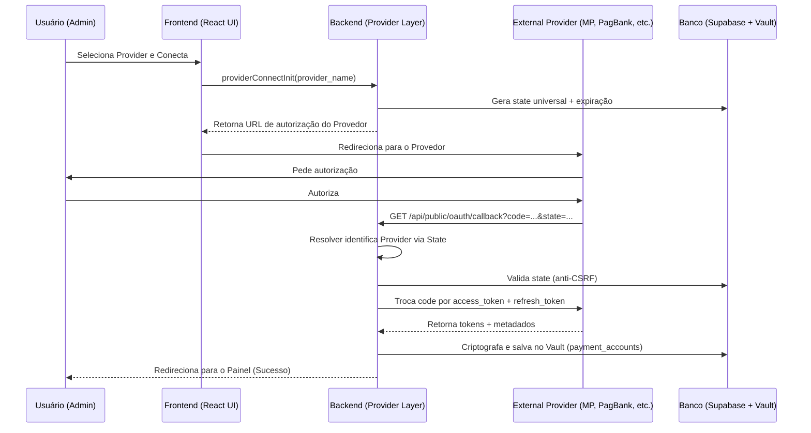
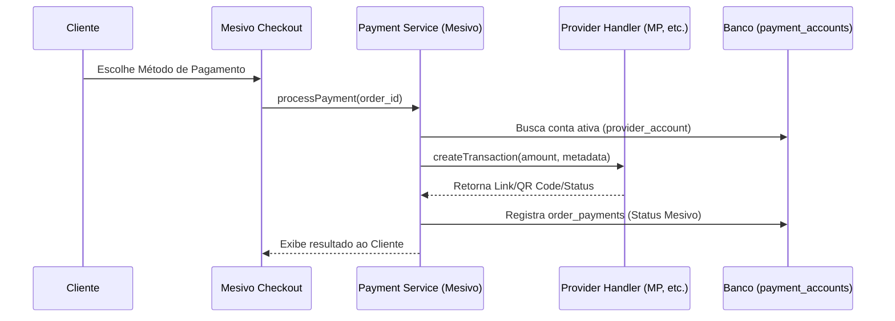

# Arquitetura Payment Provider Framework — Mesivo V4

Esta arquitetura define a infraestrutura universal para meios de pagamento da Mesivo, projetada para ser desacoplada e suportar múltiplos provedores (Mercado Pago, PagBank, Stripe, etc.) sem remodelagem estrutural.

## 1. Fluxo de Autorização Universal (OAuth 2.0)

## 2. Camadas do Framework

A arquitetura segue uma divisão rigorosa de responsabilidades:

1. **Restaurant Layer:** Entidade dona das configurações.
2. **Payment Provider Layer:** Interface comum (`PaymentProviderInterface`).
3. **OAuth Layer:** Handlers específicos para troca e renovação de tokens.
4. **Token Layer:** Armazenamento seguro e genérico no Vault.
5. **Webhook Layer:** Receptor universal com roteamento para Handlers específicos.
6. **Payment Services:** Lógica de negócio (Pix, Cartão) que consome os Providers.
7. **Orders & Financeiro:** Consumidores finais do resultado da transação.

## 3. Interface Comum do Provider

Cada provedor deve implementar obrigatoriamente:
- `startAuthorization()`: Gera URL de auth.
- `exchangeCode()`: Troca código por tokens.
- `refreshToken()`: Renova tokens expirados.
- `disconnect()` / `revoke()`: Encerra a conexão.
- `validateWebhook()`: Valida assinaturas de eventos.
- `processWebhook()`: Converte payload proprietário para o formato Mesivo.
- `getAccount()`: Retorna metadados da conta conectada.
- `getCapabilities()`: Informa quais métodos são suportados (Pix, Crédito, etc).

## 4. Fluxo de Pagamento Universal

## 5. Estratégia de Webhooks (Resolver)

- **Endpoint Único:** `/api/public/webhooks/payments`
- **Roteamento:** O corpo ou headers da requisição identificam o provedor.
- **Handler:** O `WebhookResolver` despacha para o `ProviderHandler` correspondente.
- **Normalização:** O Handler traduz o status externo (ex: `approved`) para o status interno da Mesivo (ex: `paid`).

## 6. Segurança e Vault

- **Nomes Genéricos:** Nenhuma coluna no banco deve referenciar provedores específicos.
- **Campos:** `provider_access_token`, `provider_refresh_token`, `provider_token_expires_at`.
- **Encryption:** AES-256-GCM com chaves gerenciadas pelo Vault.
- **Isolamento:** Multi-tenant garantido por `restaurant_id` em todas as tabelas de contas.

## 7. Escalabilidade (Futuro)

Para adicionar um novo provedor (ex: Stripe):
1. Criar pasta `src/lib/payments/providers/stripe/`.
2. Implementar a interface comum.
3. Adicionar o provedor no ENUM `payment_provider`.
4. Ativar Feature Flag `payments.providers.stripe`.
5. **Resultado:** Nenhuma alteração no core do sistema é necessária.
