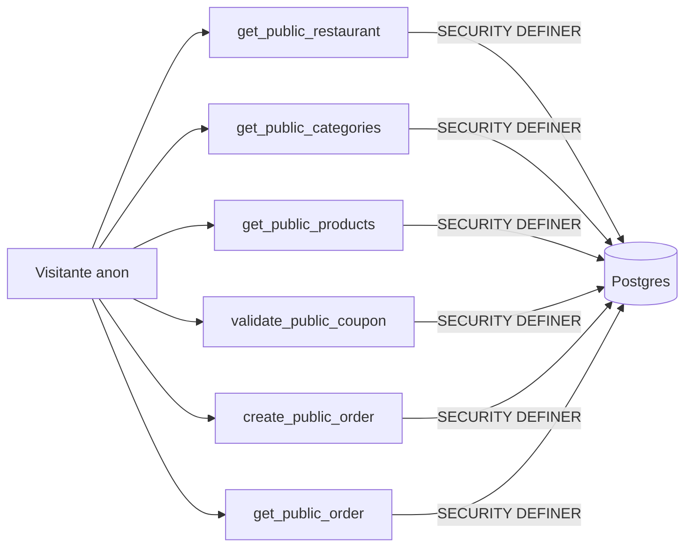

# Row-Level Security — Comandex

Toda tabela em `public.*` tem RLS habilitado. O padrão é **negar por default**; policies liberam o mínimo necessário.

## Roles Envolvidos

| Role | Origem |
|---|---|
| `anon` | Sem autenticação (visitante do cardápio) |
| `authenticated` | Usuário logado via Supabase Auth |
| `service_role` | Chamadas internas de servidor / admin |

## Padrões

### Público sem autenticação
Tabelas do cardápio (`restaurants`, `categories`, `products`) **não** expõem SELECT para `anon`.
Todo acesso público passa por RPCs `SECURITY DEFINER` que filtram por `slug` e `is_active`:
- `get_public_restaurant(p_slug)`
- `get_public_categories(p_slug)`
- `get_public_products(p_slug)`
- `get_public_order(p_id)`

### Autenticado (dono/equipe)
Policies usam helper `is_team_owner(auth.uid(), restaurant_id)`:
- Retorna `true` para o `owner_id` do restaurante OU `super_admin`.
- Equipe (`manager`/`employee`) tem acesso operacional via RPCs (`update_order_status`, `list_team_members`, etc.).

### Super Admin
Verificação via `user_roles WHERE role='super_admin'`.
Acesso a `app_plans`, `app_settings`, `global_announcements`, `restaurant_payments`, todas as leituras cross-tenant.

## Policies por Tabela (resumo)

| Tabela | anon | authenticated | Regra |
|---|---|---|---|
| `restaurants` | ❌ | SELECT via `is_team_owner`; UPDATE via `is_team_owner` | Nunca expor lista completa |
| `restaurant_secrets` | ❌ | SELECT/UPDATE via `private.is_restaurant_owner` | MP access token isolado |
| `categories` | ❌ | ALL via `is_team_owner` | Público via RPC |
| `products` | ❌ | ALL via `is_team_owner` | Público via RPC |
| `orders` | ❌ | SELECT via `is_team_owner` OR team member; INSERT bloqueado (usar RPC) | UPDATE em `status` bloqueado por trigger |
| `order_items` | ❌ | SELECT via join de `orders` | INSERT somente via RPC |
| `order_status_history` | ❌ | SELECT via RPC `get_order_history` | INSERT apenas via `update_order_status` |
| `customers` | ❌ | ALL via `is_team_owner` | Upsert público via RPC |
| `coupons` | ❌ | ALL via `is_team_owner` | Validação pública via `validate_public_coupon` |
| `coupon_uses` | ❌ | SELECT via `is_team_owner` | INSERT via `create_public_order` |
| `cash_sessions` / `cash_movements` | ❌ | ALL via `is_team_owner` | |
| `user_roles` | ❌ | SELECT próprio; ALL super_admin | Owner sincronizado por trigger |
| `restaurant_invites` | ❌ | SELECT via `is_team_owner`; aceitação via RPC | Convidado usa token público via RPC |
| `app_plans` | SELECT | SELECT | Necessário para landing exibir planos |
| `app_settings` | SELECT (whitelist) | SELECT | Somente chaves whitelisted são públicas |
| `global_announcements` | SELECT ativos | SELECT ativos; ALL super_admin | |
| `signup_leads` | INSERT | SELECT super_admin | |
| `email_send_log` | ❌ | SELECT super_admin | Escrita via service_role |
| `suppressed_emails` | ❌ | SELECT super_admin | |

## Fluxos

### Público (cardápio)

### Autenticado (painel do restaurante)
- Login → `useAuth` carrega `user_roles` do usuário.
- Query direta em tabelas OK — RLS filtra por `is_team_owner`.
- Escrita crítica (status de pedido, convite, cupom) via RPC.

### Administrativo (owner + manager)
- Owner: acesso total ao restaurante.
- Manager: acesso operacional + config (equipe, cupons, horários).
- Diferenciado via `user_roles.role IN ('owner','manager')` nas RPCs sensíveis.

### Super Admin
- `super_admin` bypassa `is_team_owner` (dentro do helper).
- Acesso a métricas cross-tenant, gestão de planos, comunicados globais.

## Anti-padrões Proibidos

- ❌ `GRANT ALL ON public.tabela TO anon`
- ❌ Policies que checam papel em `profiles` (usar `user_roles`)
- ❌ `USING (true)` sem filtro
- ❌ INSERT/UPDATE direto em `orders.status` a partir do cliente
- ❌ Expor `restaurant_secrets` por join
