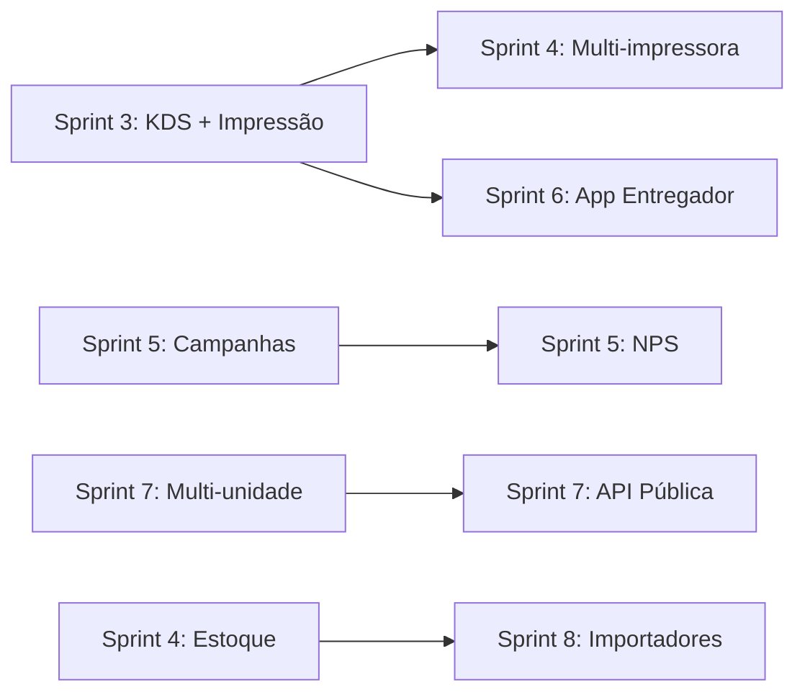

# Roadmap Técnico — Comandex

Legenda: ✅ concluído · 🚧 em planejamento · 🎯 sprint atual

## Sprint 3 — Operação em Tempo Real 🎯

Impacto: alto (diferencial competitivo vs iFood).

| Módulo | Descrição | Dependências |
|---|---|---|
| **KDS (Kitchen Display System)** | Tela dedicada por estação (cozinha, bar). Drag entre estados. Timer por pedido. Alerta sonoro. | ✅ State machine (Sprint 2.2.e), ✅ Events (2.2.f) |
| **Impressão automática** | Impressão térmica ESC/POS via ponte local (agent) OR PDF direto no navegador. Config por tipo (cozinha, cliente). | KDS |
| **Notificações sonoras** | Novo pedido, mudança de status, alerta de atraso. | Realtime já existente |
| **Confirmação automática de PIX** | Webhook MP → `payment_status=paid` → auto `confirmed`. | ✅ RPC `update_order_status` |

## Sprint 4 — Financeiro & Operacional

| Módulo | Descrição | Dependências |
|---|---|---|
| **Fechamento de caixa avançado** | Relatório por método de pagamento, sangrias, suprimentos, diferença esperado vs contado. Email do fechamento. | ✅ `cash_sessions/movements` |
| **Relatórios gerenciais** | DRE simplificado, ticket médio, produtos mais vendidos, horários de pico, funil de conversão. | Denormalização de `orders` |
| **Gestão de estoque básica** | Baixa automática no venda, alerta low_stock. | Trigger nova em `order_items` |
| **Multi-impressora** | Roteamento por categoria (bebidas → bar, comida → cozinha). | Impressão (Sprint 3) |

## Sprint 5 — CRM & Retenção

| Módulo | Descrição | Dependências |
|---|---|---|
| **Segmentação avançada** | View materializada `customer_segments`. Tags automáticas. | ✅ Customers |
| **Campanhas WhatsApp** | Integração WhatsApp Business API. Templates aprovados. | API oficial WA |
| **Programa de fidelidade** | Cashback + pontos. Config por restaurante. | `loyalty_config` JSONB |
| **NPS automático** | Envio 24h após pedido `delivered`. Dashboard de satisfação. | Campanhas |
| **Audit log** | Tabela genérica `audit_log`. RPC helpers. | — |

## Sprint 6 — Mesas & Comandas 🎯 (Fase 1 ✅)

| Módulo | Descrição | Status |
|---|---|---|
| **Schema + RPCs** | Cadastro, sessões, comandas, split, transferência, merge, QR público. Reutiliza pedidos oficiais. | ✅ Fase 1 |
| **UI Mapa + Cadastro + QR** | `admin.mesas`, `admin.mesas.cadastro`, realtime, componentes DS. | 🚧 Fase 2 |
| **Split, transferência, merge, timeline** | UI completa de sessão + fluxo self-service via QR. | 🚧 Fase 3 |

## Sprint 6.5 — Delivery & Logística

| Módulo | Descrição | Dependências |
|---|---|---|
| **App do entregador (PWA)** | Rota `/driver`. Login por code. Aceitar/recusar. Rota otimizada. | ✅ `delivery_drivers` |
| **Atribuição automática** | Algoritmo por proximidade + carga atual. | Geolocalização |
| **Tracking em tempo real** | Cliente vê entregador no mapa. | Realtime + coords |
| **Múltiplas entregas** | Entregador com N pedidos simultâneos. | App entregador |

## Sprint 7 — Escala & Multi-unidade

| Módulo | Descrição | Dependências |
|---|---|---|
| **Multi-unidade (redes)** | Grupo de restaurantes, gestão consolidada. | Nova tabela `restaurant_groups` |
| **API pública** | Endpoints REST com API keys. Rate limit. | Sistema de keys |
| **Webhooks para restaurantes** | Notificar sistema externo em eventos. | ✅ Events |
| **Custom domain** | CNAME por restaurante. Cert auto. | Business plan feature |

## Sprint 8 — Importadores

| Módulo | Descrição |
|---|---|
| **Importador iFood** | OAuth iFood → sync cardápio + pedidos. |
| **Importador Anota Aí** | Migração one-shot de cardápio. |
| **Import CSV clientes** | UI + validação em lote. |

## Dependências Cross-Sprint

## Débito Técnico Priorizado

Ver [TODO.md](./TODO.md).
